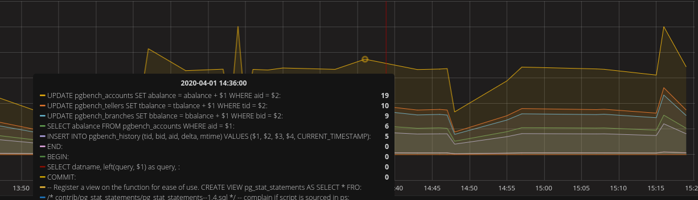

# ClickHouse Grafana pg_stat_statements

## demo


Custom Docker container + compose providing:
* [Clickhouse](https://github.com/yandex/ClickHouse/) Database _(latest)_
* [Grafana](https://github.com/grafana/grafana) w/ autoprovisioned [Clickhouse Datasource](https://github.com/Vertamedia/clickhouse-grafana) _(latest)_

## Usage
```
python3 -mvenv .venv
source .venv/bin/activate
pip install -r ./collector/requirements.txt

make up
make migrate
make run
```
then go to `localhost:3000` and select dashboard `pg_stat_stamenents`

query from Grafana
```sql
SELECT
    t,
    groupArray((query, rate)) AS groupArr
FROM
(
    SELECT
        t,
        query,
        if(runningDifference(c) <= 0, nan, runningDifference(c) / runningDifference(t / 1000)) AS rate
    FROM
(
        SELECT
            (intDiv(toUInt32(created_at), $interval) * $interval) * 1000 AS t,
            query,
            max(calls) AS c
        FROM pg.pg_stat_statements
        WHERE
            ((created_date >= toDate($from)) AND(created_date <= toDate($to)))
            AND((created_at >= toDateTime($from)) AND(created_at <= toDateTime($to)))
            AND query IN (
    SELECT query
    FROM pg.pg_stat_statements
    WHERE
        ((created_at >= toDateTime($from)) AND(created_at <= toDateTime($to)))
        AND created_date >= toDate($from)
        AND created_date <= toDate($to)
    GROUP BY query
    ORDER BY sum(total_time) DESC
    LIMIT 15)
        GROUP BY
            t,
            query
        ORDER BY
            query ASC,
            t ASC
)
    WHERE rate >= 0
)
GROUP BY t
ORDER BY t ASC
```

or (uses 2 times less rows):
```sql
SELECT
    t,
    groupArray((query, rate)) AS groupArr
FROM
(
    SELECT
        t,
        query,
        if(runningDifference(c) <= 0, nan, runningDifference(c) / runningDifference(t / 1000)) AS rate
    FROM
(
        SELECT
            (intDiv(toUInt32(created_at), $interval) * $interval) * 1000 AS t,
            query,
            max(total_time) AS c
        FROM pg.pg_stat_statements
        WHERE
            ((created_date >= toDate($from)) AND(created_date <= toDate($to)))
            AND((created_at >= toDateTime($from)) AND(created_at <= toDateTime($to)))
            AND cluster_name = 'docker'
            AND hostname = 'notebook'
        GROUP BY
            t,
            query
        ORDER BY
            query ASC,
            t ASC
)
    WHERE rate >= 0
)
GROUP BY t
ORDER BY t ASC
```
